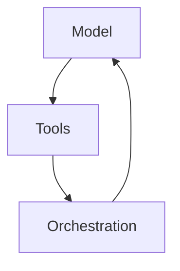

# Visual Summary

This skill augments the datacamp-summary capability by generating a lightweight visual representation that complements the markdown overview. The goal is to make concepts more memorable by pairing text with a basic diagram or structured table.

**What the Skill Does**

- **Consumes** transcript text and optional exercise material.
- **Creates** a concise markdown summary (overview, key concepts) as before.
- **Generates** a simple visual aid such as a Mermaid diagram, ASCII art flowchart, or tabular representation of core ideas.

**Inputs**

- `Transcript.txt` and optional `Exercise.txt` content (path or raw text).
- An optional hint specifying preferred visual type (`diagram`, `table`, `list`).

**Output**

A markdown string containing both the textual summary and the visual aid. For example:

```markdown
## Overview
...

## Visual Aid


## Key Concepts
- ...
```

The visual aid should be simple enough to render in notebooks using Mermaid or plain markdown tables.

**When to Use This Skill**

Invoke when users want both text and a diagram/table summarizing the material. It’s especially useful for lessons with distinct components or workflows.

**Example Prompts**

- "Summarize this transcript and give me a diagram of the agentic components."
- "Create notes and include a visual table comparing agency levels."
- "Provide a markdown summary plus a Mermaid flowchart." 

**Workflow**

1. Read input files or text.
2. Identify main parts and relationships.
3. Draft summary paragraphs as in datacamp-summary.
4. Choose a visualization type based on hints or content.
5. Generate corresponding Mermaid or markdown table code.
6. Return combined markdown.

**Tips & Clarifications**

- Visuals should remain simple; avoid complex graphs that won’t render.
- Prefer Mermaid for easy notebook rendering (ensure cells use `%%mermaid` if necessary).
- Take care with Mermaid syntax: avoid unescaped `[` or `]` inside labels, wrap multi-word labels in quotes, and don’t mix subgraph keywords with bracket notation. These precautions prevent parse errors like the one seen earlier.
- If content lacks clear structure, fall back to bulleted lists instead of diagrams.
- Encourage users to review and tweak the visual manually if needed.

> This skill focuses on supplementing summaries with visuals; it does not perform advanced graphic design or external image generation.